# PAR GPT Architecture Documentation

This document provides a comprehensive overview of PAR GPT's architecture, design patterns, and module organization.

## Table of Contents

1. [Overview](#overview)
2. [High-Level Architecture](#high-level-architecture)
3. [Module Organization](#module-organization)
4. [Design Patterns](#design-patterns)
5. [Data Flow](#data-flow)
6. [Security Architecture](#security-architecture)
7. [Performance Optimizations](#performance-optimizations)
8. [Extension Points](#extension-points)

## Overview

PAR GPT is a sophisticated command-line AI interface built with Python 3.11+. The architecture follows modern software engineering principles including modularity, separation of concerns, lazy loading, and comprehensive security measures. The application is built around the **PAR Utils** package - a fully-integrated reusable utilities framework that provides core functionalities like performance monitoring, security validation, error handling, and caching systems.

### Key Architectural Principles

- **Modular Design**: Clear separation between CLI, commands, core logic, and external services
- **Security First**: Comprehensive path validation, code execution safety, and user confirmation systems
- **Performance Optimized**: Lazy loading system reducing startup time by 25-50%
- **Thread Safety**: Thread-safe context management for concurrent operations
- **Extensibility**: Plugin-style tool loading and command pattern for easy extension

## High-Level Architecture


## Module Organization

### Core Structure

```
src/par_gpt/
├── __main__.py                 # Entry point (39 lines)
├── cli/                        # CLI Infrastructure Layer
│   ├── app.py                 # Main Typer app (512 lines)
│   ├── options.py             # CLI option definitions
│   ├── config.py              # Configuration setup
│   ├── context.py             # Context processing
│   └── security.py            # Security validation
├── commands/                   # Command Pattern Implementation
│   ├── base.py                # BaseCommand + Mixins
│   ├── llm.py                 # LLM command
│   ├── agent.py               # Agent command
│   ├── git.py                 # Git operations
│   └── ...
├── ai_tools/                  # AI Tools (Plugin System)
│   ├── ai_tools.py            # Tool implementations
│   └── par_python_repl.py     # REPL tool
├── utils/                     # Backward Compatibility Layer
│   ├── __init__.py            # Imports from par_utils
│   ├── config_validation.py   # Pydantic validation
│   ├── context_manager.py     # Thread-safe context
│   └── utils_facade.py        # Import facade
├── agents.py                  # Agent orchestration
├── lazy_import_manager.py     # PAR GPT-specific lazy loading
└── tool_context.py           # Global tool context

src/par_utils/                  # PAR Utils Package
├── __init__.py                # Main exports
├── py.typed                   # Type declarations
├── performance/               # Performance Utilities
│   ├── timing.py              # Performance measurement
│   └── lazy_loading.py        # Lazy import management
├── security/                  # Security Utilities
│   └── path_validation.py     # Path security validation
├── errors/                    # Error Management
│   ├── registry.py            # Error message registry
│   └── handlers.py            # Error handling utilities
├── caching/                   # Caching System
│   └── disk_cache.py          # Thread-safe disk cache
└── console/                   # Console Management
    └── manager.py             # Rich console utilities
```

### Layer Responsibilities

#### CLI Layer (`cli/`)
- **Command Line Interface**: Typer app setup and argument parsing
- **Configuration Management**: Environment loading and validation
- **Context Processing**: File, URL, and image handling
- **Security Validation**: Mutual exclusivity checks and warnings

#### Command Layer (`commands/`)
- **Command Pattern**: Consistent command structure with mixins
- **Business Logic**: Implementation of specific commands
- **State Management**: Context passing and result handling
- **Error Handling**: Consistent error processing

#### Core Logic Layer
- **Agent Orchestration**: AI tool coordination and execution
- **Memory Management**: Redis-based persistent memory
- **Utility Functions**: Shared functionality across modules
- **Security Framework**: Path validation and execution safety

#### PAR Utils Package
- **Performance Optimization**: Timing measurement and lazy loading
- **Security Validation**: Path traversal protection and filename sanitization
- **Error Management**: Centralized error registry with structured messaging
- **Caching System**: Thread-safe disk caching with URL downloads
- **Console Management**: Rich-based terminal output management

## Design Patterns

### 1. Command Pattern


### 2. Strategy Pattern (Providers)


### 3. Facade Pattern (Utils Import)


### 4. Singleton Pattern (Registries)


## Data Flow

### 1. Basic LLM Mode Flow


### 2. Agent Mode Flow


### 3. Security Validation Flow


## Security Architecture

### 1. Multi-Layer Security

```mermaid
flowchart TD
    A[User Input] --> B[Layer 1: Input Validation]
    B --> C[Layer 2: User Confirmation] 
    C --> D[Layer 3: Execution Isolation]
    D --> E[Safe Execution]
    
    subgraph Layer1 ["🛡️ Layer 1: Input Validation (PAR Utils)"]
        B1[Path traversal detection]
        B2[Filename sanitization]
        B3[Size limits]
        B4[Content type validation]
    end
    
    subgraph Layer2 ["⚠️ Layer 2: User Confirmation"]
        C1[Security warnings]
        C2[Operation descriptions]
        C3[Risk explanations]
        C4[Consent prompts]
    end
    
    subgraph Layer3 ["🔒 Layer 3: Execution Isolation"]
        D1[Docker sandbox for code]
        D2[Process isolation]
        D3[Resource limits]
        D4[Network restrictions]
    end
    
    B --> Layer1
    C --> Layer2
    D --> Layer3
    
    style A fill:#1565c0
    style E fill:#1b5e20
    style Layer1 fill:#ef6c00
    style Layer2 fill:#f9a825
    style Layer3 fill:#6a1b9a
```



### 2. Path Security Implementation (PAR Utils)

```mermaid
flowchart TD
    A[User Path Input] --> B[Normalize Path]
    B --> C[Validate Pattern]
    C --> D[Check Characters]
    D --> E[Validate Length]
    E --> F[Resolve and Check]
    F --> G[✅ Safe Path]
    
    B1["Remove ..\ and ../ patterns"]
    C1["Check against traversal regex"]
    D1["Scan for dangerous characters"]
    E1["Ensure reasonable path length"]
    F1["Ensure stays within base directory"]
    
    B -.-> B1
    C -.-> C1
    D -.-> D1
    E -.-> E1
    F -.-> F1
    
    subgraph ParUtils ["PAR Utils Security Module"]
        H[SecurePathValidator]
        I[validate_within_base]
        J[sanitize_filename]
        K[PathSecurityError]
    end
    
    G --> ParUtils
    
    style A fill:#1565c0
    style G fill:#1b5e20
    style B fill:#ef6c00
    style C fill:#f9a825
    style D fill:#6a1b9a
    style E fill:#00838f
    style F fill:#c62828
    style ParUtils fill:#2e7d32
```



## Performance Optimizations

### 1. Lazy Loading System (PAR Utils)


### 2. Command Classification

```mermaid
graph LR
    subgraph "Command Performance Comparison"
        A[Minimal Commands<br/>--version, --help<br/>⏱️ ~1.45s]
        B[Basic LLM Commands<br/>llm command<br/>⏱️ ~2.5s]
        C[Full Agent Commands<br/>agent command<br/>⏱️ ~3.5s]
    end
    
    subgraph "Modules Loaded"
        A1[Core only<br/>• __main__.py<br/>• Basic CLI]
        B1[Core + LLM<br/>• Provider libraries<br/>• Configuration<br/>• Security modules]
        C1[All modules on-demand<br/>• Tools loaded by keyword<br/>• Heavy deps when used]
    end
    
    A --> A1
    B --> B1
    C --> C1
    
    style A fill:#2e7d32
    style B fill:#f9a825
    style C fill:#c62828
    style A1 fill:#1b5e20
    style B1 fill:#f57f17
    style C1 fill:#ff6f00
```



### 3. Advanced Timing System (PAR Utils)


**Key Benefits:**
- **Accurate Performance Metrics**: Pure processing time without user delay skew
- **User Experience Analytics**: Track actual user response times
- **Bottleneck Identification**: Distinguish processing vs user interaction delays
- **Automation Planning**: Estimate true processing time for automated workflows

## Lazy Loading Architecture

PAR GPT uses a two-layer lazy loading system:

### Generic Layer (PAR Utils)
The base `LazyImportManager` from PAR Utils provides:
- Thread-safe import caching
- Module and item-specific lazy loading
- Cache management and statistics

### Application Layer (PAR GPT)
The `PARGPTLazyImportManager` extends the base class with:
- Command-specific import loading (`load_agent_imports`, `load_basic_llm_imports`, etc.)
- Integration with PAR GPT's command structure
- Provider and tool-specific loading strategies

### Usage Pattern

```python
# For PAR GPT-specific functionality
from par_gpt.lazy_import_manager import PARGPTLazyImportManager

manager = PARGPTLazyImportManager()
agent_imports = manager.load_agent_imports()

# For generic lazy loading (e.g., in AI tools)
from par_utils import LazyImportManager

generic_manager = LazyImportManager()
module = generic_manager.get_cached_import("some_module")
```

## Extension Points

### 1. Adding New Commands

```python
# 1. Create command class
class MyCommand(BaseCommand, LLMCommandMixin):
    def execute(self, ctx: typer.Context, my_option: bool) -> None:
        state = ctx.obj
        # Implementation here

# 2. Create factory function
def create_my_command():
    def my_command(ctx: typer.Context, my_option: bool = False) -> None:
        command = MyCommand()
        command.execute(ctx, my_option)
    return my_command

# 3. Register in __main__.py
app.command()(create_my_command())
```

### 2. Adding New AI Tools

```python
# 1. Create tool function
@tool(parse_docstring=True)
def my_new_tool(param: str) -> str:
    """Tool description.
    
    Args:
        param: Parameter description.
        
    Returns:
        Result description.
    """
    return "Tool result"

# 2. Add to lazy_tool_loader.py
def build_ai_tool_list(keywords: set[str]) -> list[BaseTool]:
    tools = [ai_fetch_url, ai_web_search, ...]
    
    if "my_keyword" in keywords:
        tools.append(my_new_tool)
    
    return tools
```

### 3. Adding New Providers

```python
# In par_ai_core library:
class MyProvider(BaseLlmProvider):
    def build_chat_model(self) -> BaseChatModel:
        # Implementation
        pass

# Register provider in par_ai_core
LlmProvider.MY_PROVIDER = "MyProvider"
```

### 4. Custom Error Messages

```python
from par_gpt.utils.error_registry import ErrorMessage, ErrorCategory, ErrorSeverity, register_error

# Register new error
register_error(ErrorMessage(
    code="MY_CUSTOM_ERROR",
    message="Custom error: {details}",
    category=ErrorCategory.CUSTOM,
    severity=ErrorSeverity.ERROR,
    solution="Fix the custom issue",
))

# Use in code
from par_gpt.utils.error_helpers import ErrorHandler
handler = ErrorHandler(console)
handler.show_error("MY_CUSTOM_ERROR", details="specific issue")
```

## Threading and Concurrency

### Thread-Safe Context Management


## Conclusion

This architecture provides a solid foundation for a secure, performant, and extensible AI CLI tool. The modular design allows for easy maintenance and extension, while the comprehensive security measures ensure safe operation even with potentially dangerous AI-generated code execution.

Key architectural strengths:
- **Clean separation of concerns** between layers and packages
- **Comprehensive security** with multiple validation layers powered by PAR Utils
- **High performance** through lazy loading optimization from PAR Utils
- **Easy extensibility** via plugin patterns and modular utilities
- **Thread safety** for concurrent operations using PAR Utils registries
- **Consistent error handling** with centralized registry in PAR Utils
- **Reusable utilities** via the generalized PAR Utils package
- **Backward compatibility** maintained through facade patterns

The architecture has evolved through multiple iterations to address technical debt while maintaining backward compatibility and enhancing security and performance. The extraction of PAR Utils creates a reusable foundation that can benefit other projects while keeping PAR GPT's core functionality intact.